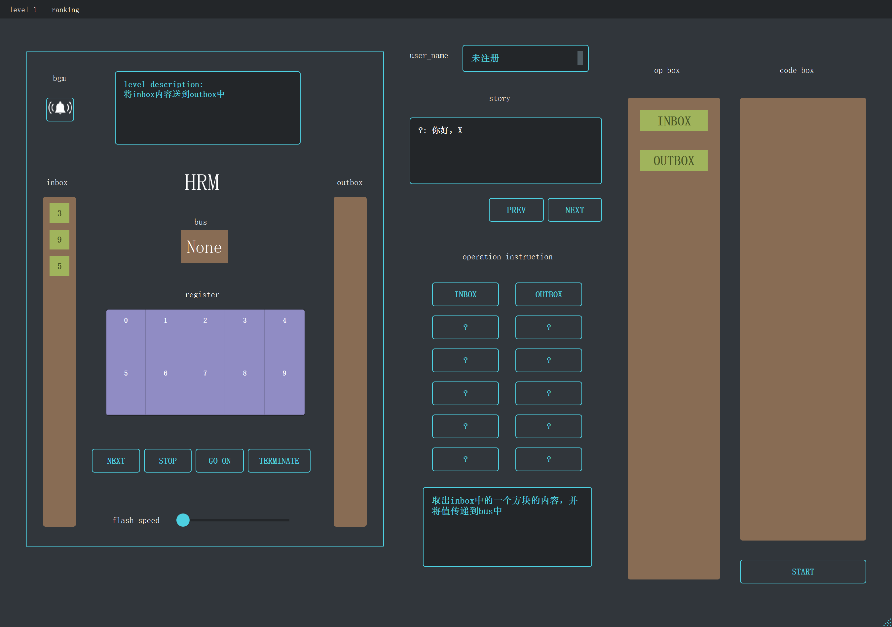

# 自己动手写 Human Resource Machine 

## Introduction
该项目为我的毕业设计，游戏名为为HRM Corporation，是Human Resource Machine的Python实现。

该项目将Human Resource Machine的编程和由《脑叶公司》启发独创的剧情结合起来，做成了一个简单的小游戏。

## Description

游戏的玩法和Human Resource Machine几乎相同。玩家通过拖动op box中的指令到code box，一些特定的指令需要手动设置参数。

除此之外，玩家可以通过上次自己的过关数据，并在ranking中看到自己的通关信息。

顺带说一句：该游戏有跳关指令，玩家可以自己摸索。

## 游戏游玩

游戏的zip文件可以通过release，目前为0.3.0版本。

解压文件夹后，点击setup.exe即可启动游戏。

## 鸣谢

游戏的engine部分使用的是eruvanos/hrm_python中的engine，作者的主要工作是UI重做和关卡剧情设计。